## Prepare Azure

- If you don't already have a *Resource Group*, create and and configure one
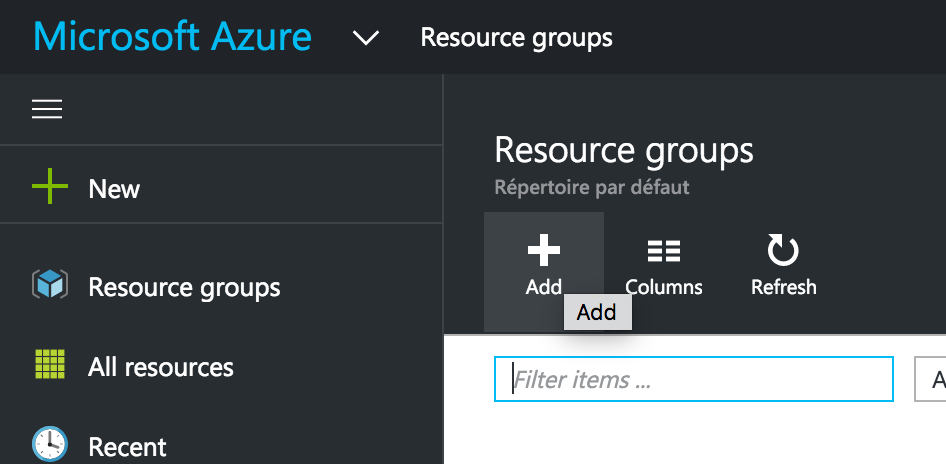
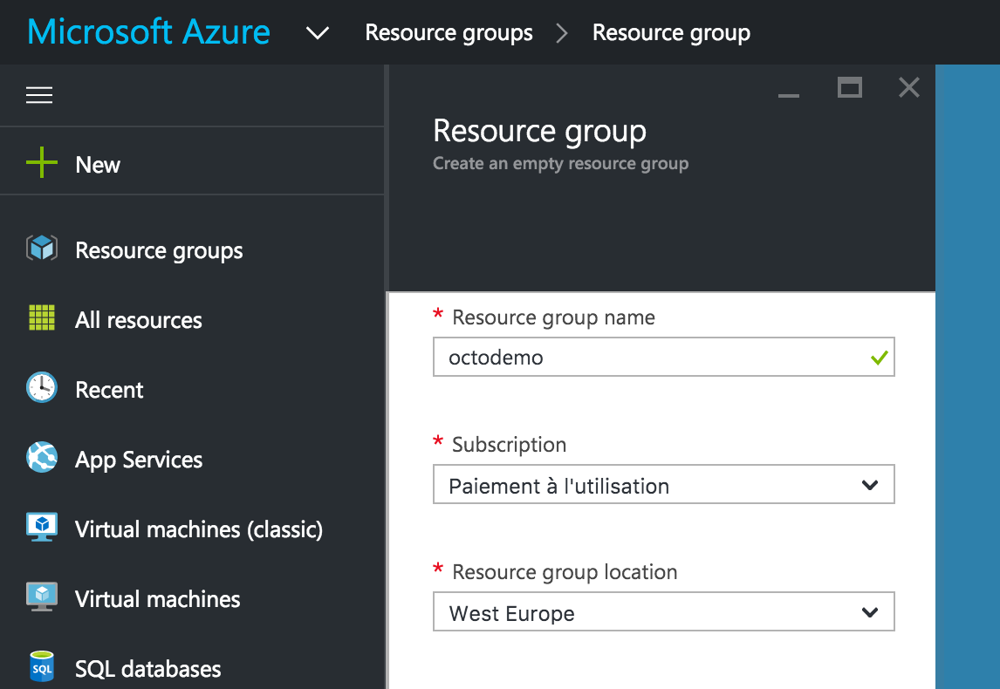

- If you don't already have an *Active Directory* in your Resource Group, create a new one : New, Security + Identity, Active Directory

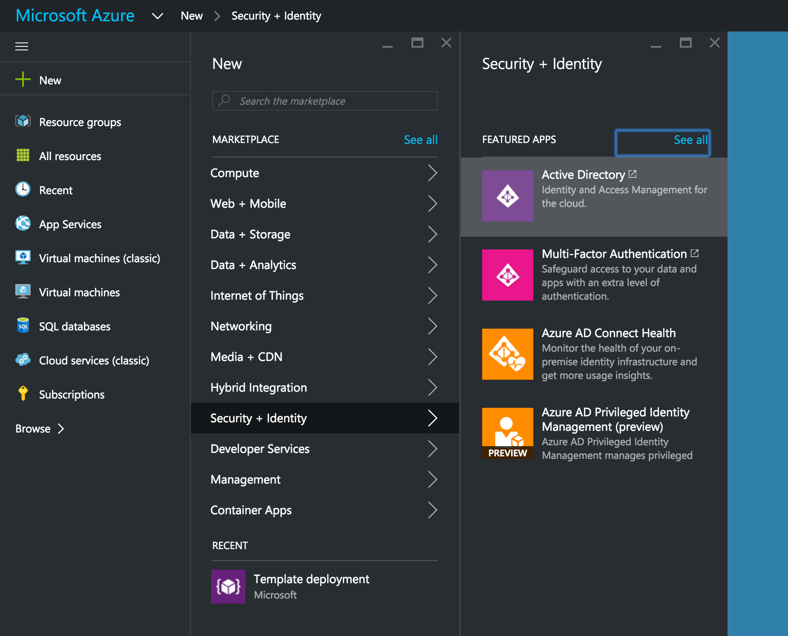

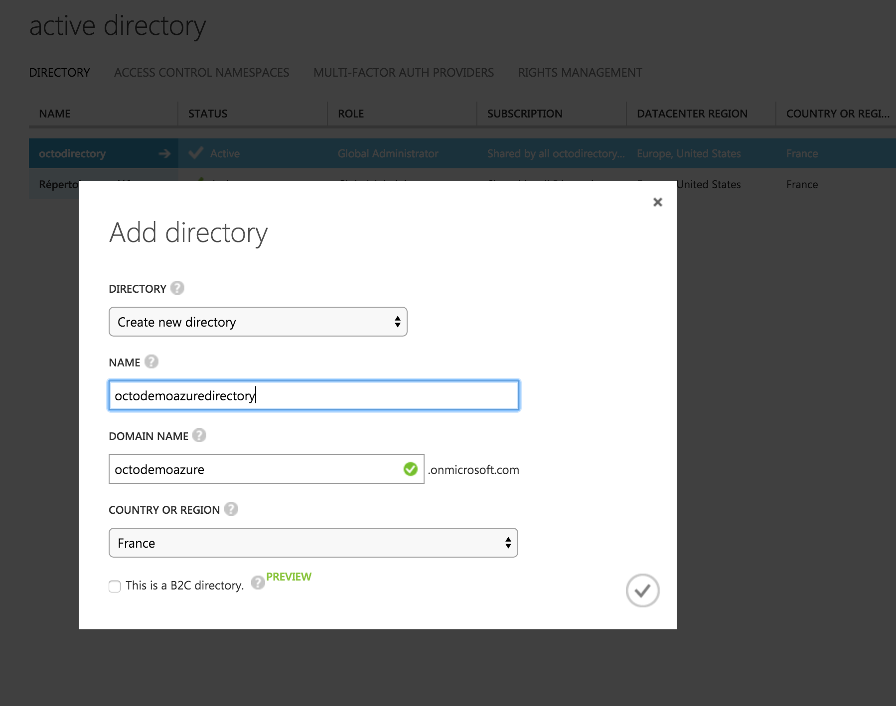

- Make sure you have some users in your Active Directory

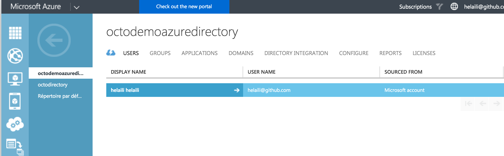

## Install GitHub Enterprise

- Install GHE from [the Enterprise website](https://enterprise.github.com/evaluations/)
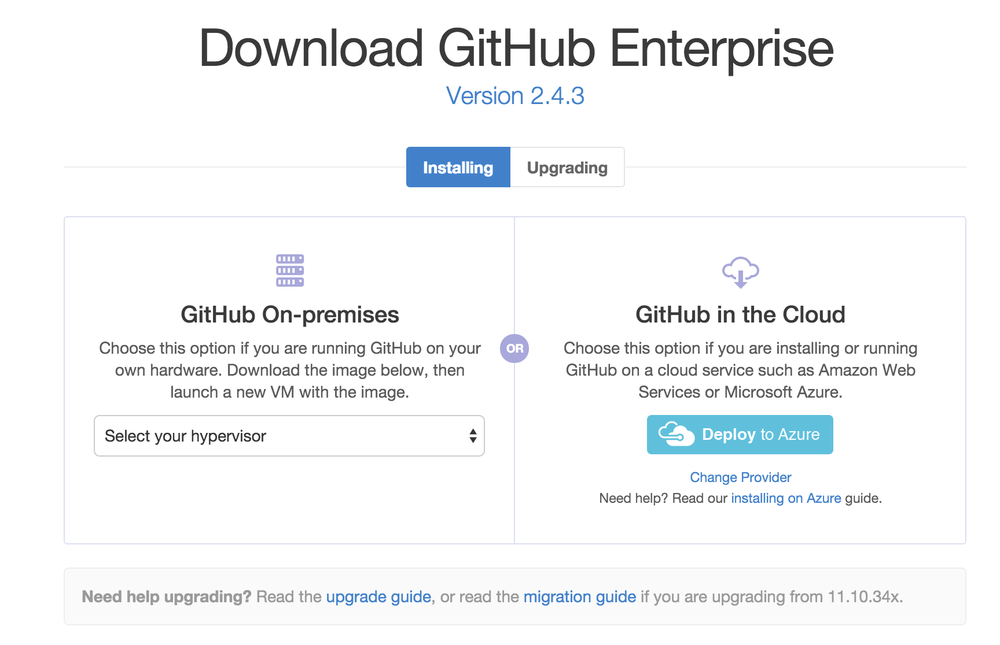

- Fill up the settings. Don't use *admin* for ADMINUSERNAME, it will be rejected... later. Make sure you are selecting your resource group,
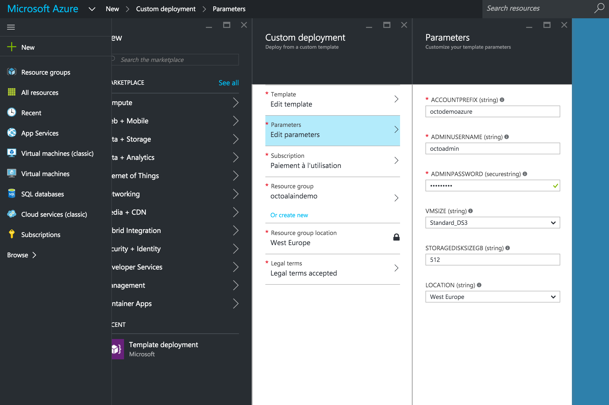

- Go to your VM anc click on its public IP address. That will display the public DNS name.
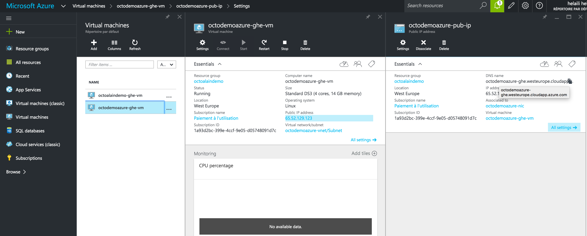

- Navigate to your GitHub Enterprise VM (https on port 8443) to finish the setup (license, admin password)

- Save the settings. We will configure authentication later.

## Configure Acitve Directory

- Navigate to the Applications tab on your Active Directory (Browse/Active Directory from the Azure Portal)
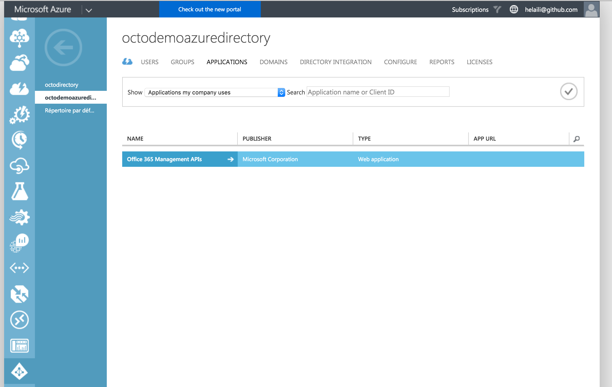

- Add an application, select "Add an application my organization is developing"
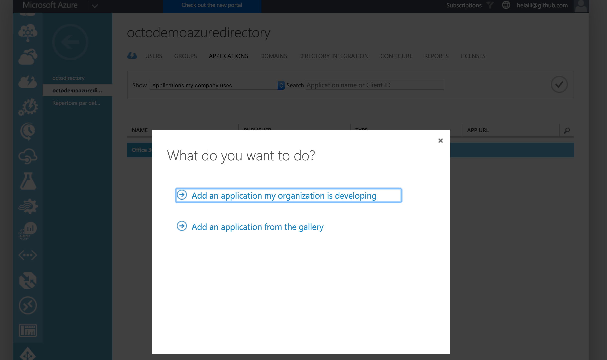

- Give it a name and click the right arrow
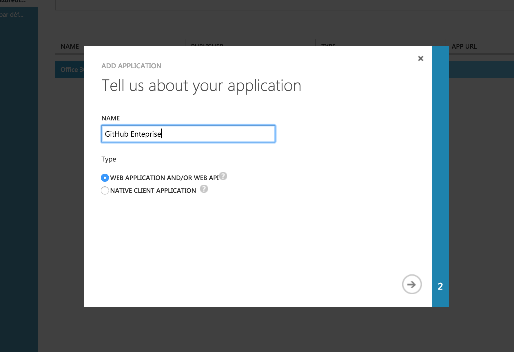

- Enter your GHE instance URL for both the Sign On URL and the APP ID URI and click the check mark
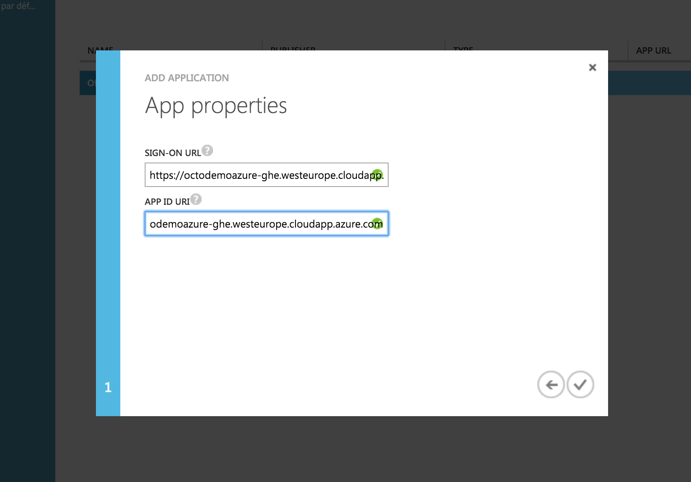

- Click on 'Enable Users to Sign On' (you can later go back to this screen by clicking the blue cloud next to *Dashboard*)
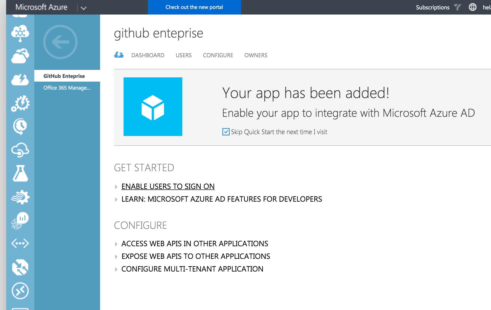

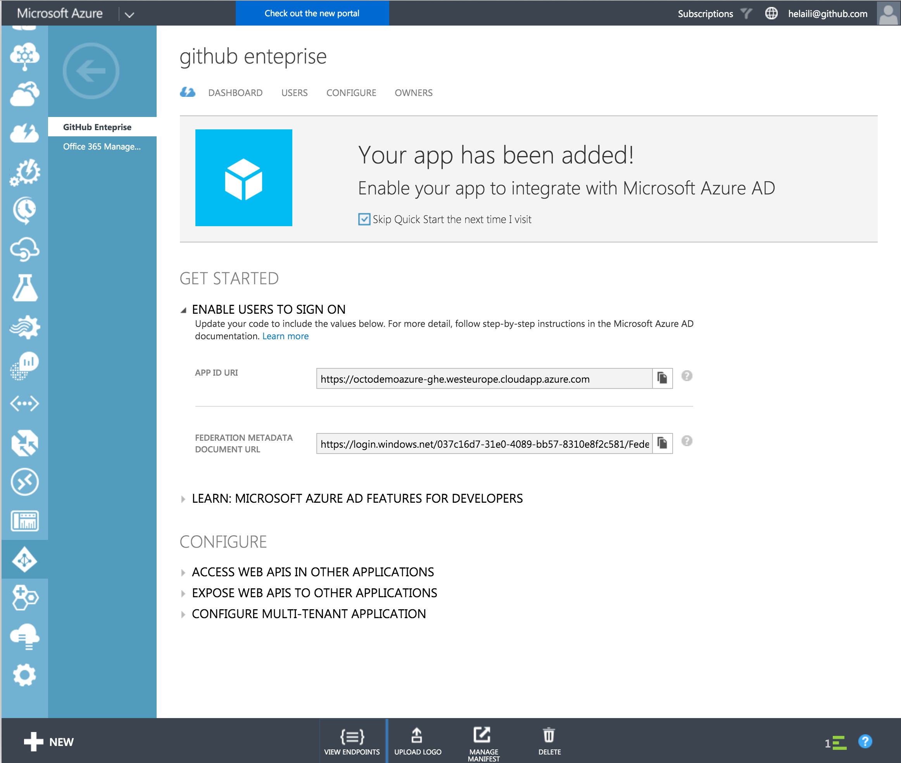

- Navigate to your FEDERATION METADATA DOCUMENT URL (https://login.windows.net/037c16d7-31e0-4089-bb57-8310e8f2c581/FederationMetadata/2007-06/FederationMetadata.xml)
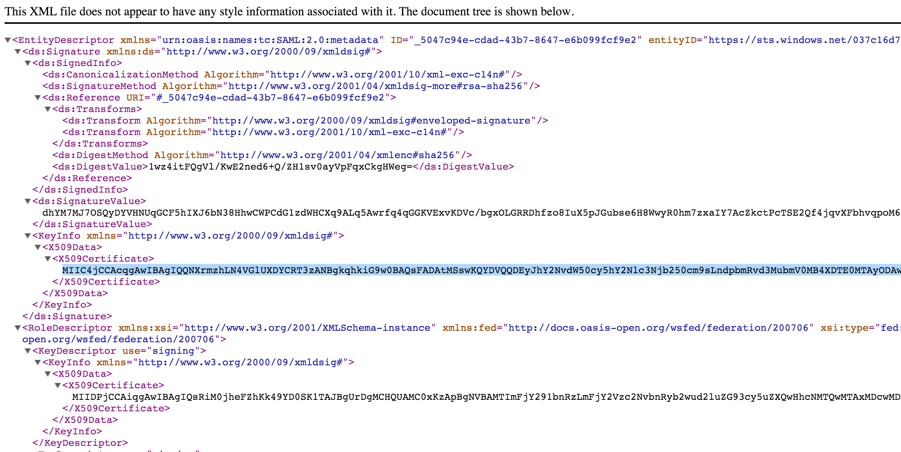

- Copy the value of the the X509Certificate and paste it into a file as follow (wrapping lines after 80 characters):

```
-----BEGIN CERTIFICATE-----
MIIC4jCCAcqgAwIBAgIQQNXrmzhLN4VGlUXDYCRT3zANBgkqhkiG9w0BAQsFADAtMSswKQYDVQQDEyJ
hY2NvdW50cy5hY2Nlc3Njb250cm9sLndpbmRvd3MubmV0MB4XDTE0MTAyODAwMDAwMFoXDTE2MTAyNz
AwMDAwMFowLTErMCkGA1UEAxMiYWNjb3VudHMuYWNjZXNzY29udHJvbC53aW5kb3dzLm5ldDCCASIwD
QYJKoZIhvcNAQEBBQADggEPADCCAQoCggEBALyKs/uPhEf7zVizjfcr/ISGFe9+yUOqwpel38zgutvL
HmFD39E2hpPdQhcXn4c4dt1fU5KvkbcDdVbP8+e4TvNpJMy/nEB2V92zCQ/hhBjilwhF1ETe1TMmVjA
Ls0KFvbxW9ZN3EdUVvxFvz/gvG29nQhl4QWKj3x8opr89lmq14Z7T0mzOV8kub+cgsOU/1bsKqrIqN1
fMKKFhjKaetctdjYTfGzVQ0AJAzzbtg0/Q1wdYNAnhSDafygEv6kNiquk0r0RyasUUevEXs2LY3vSgK
sKseI8ZZlQEMtE9/k/iAG7JNcEbVg53YTurNTrPnXJOU88mf3TToX14HpYsS1ECAwEAATANBgkqhkiG
9w0BAQsFAAOCAQEAfolx45w0i8CdAUjjeAaYdhG9+NDHxop0UvNOqlGqYJexqPLuvX8iyUaYxNGzZxF
gGI3GpKfmQP2JQWQ1E5JtY/n8iNLOKRMwqkuxSCKJxZJq4Sl/m/Yv7TS1P5LNgAj8QLCypxsWrTAmq2
HSpkeSk4JBtsYxX6uhbGM/K1sEktKybVTHu22/7TmRqWTmOUy9wQvMjJb2IXdMGLG3hVntN/WWcs5w8
vbt1i8Kk6o19W2MjZ95JaECKjBDYRlhG1KmSBtrsKsCBQoBzwH/rXfksTO9JoUYLXiW0IppB7DhNH4P
J5hZI91R8rR0H3/bKkLSuDaKLWSqMhozdhXsIIKvJQ==
-----END CERTIFICATE-----

```

- Click on "View Endpoints" and copy your SAML-P SIGN-ON ENDPOINT (https://login.microsoftonline.com/037c16d7-31e0-4089-bb57-8310e8f2c581/saml2)
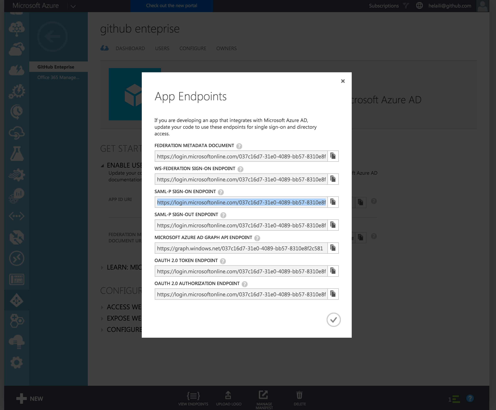

- Navigate to your GitHub Enterprise settings page on port 8443
- In Authentication, select SAML
- Enter your SAML-P SIGN-ON ENDPOINT for the Single sign-on URL
- Select your certificate file for the Verification certificate
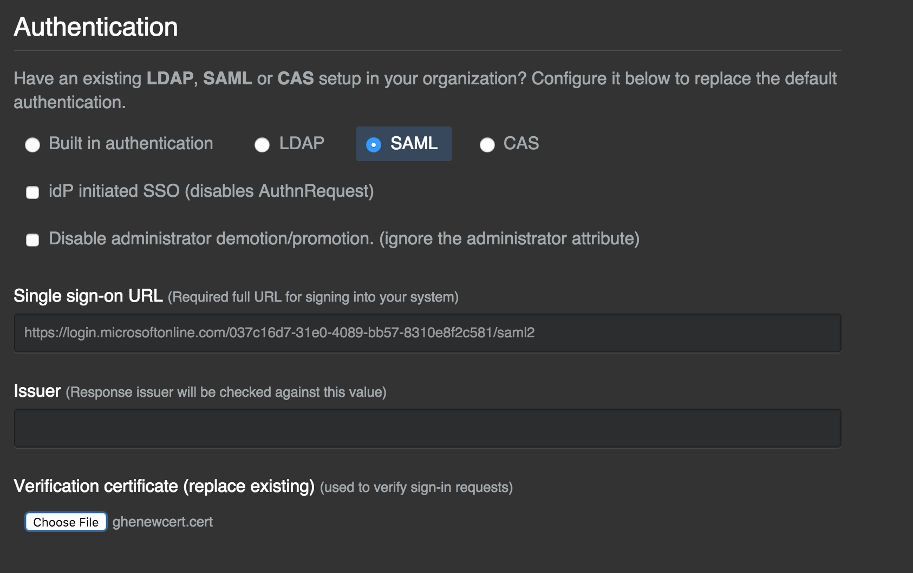

- Visit your instance. You will be redirected to the Active Directory authentication page. Log in.


- Voila!!!!
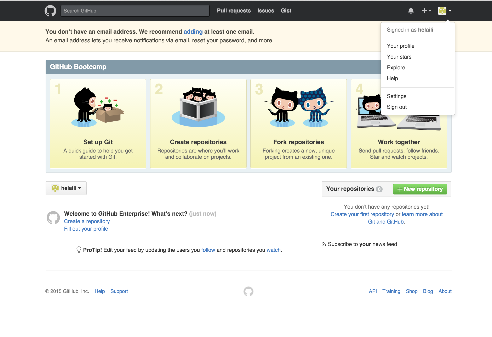
